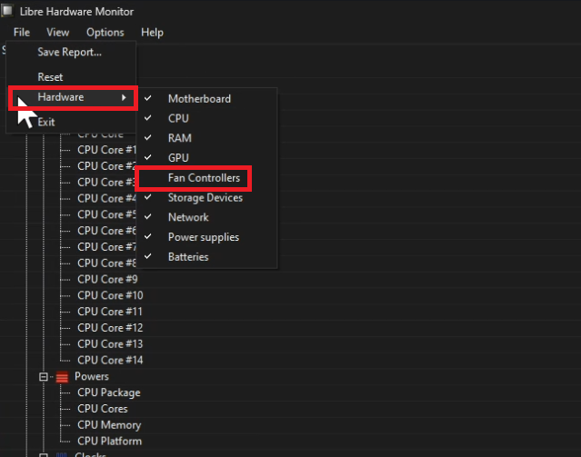
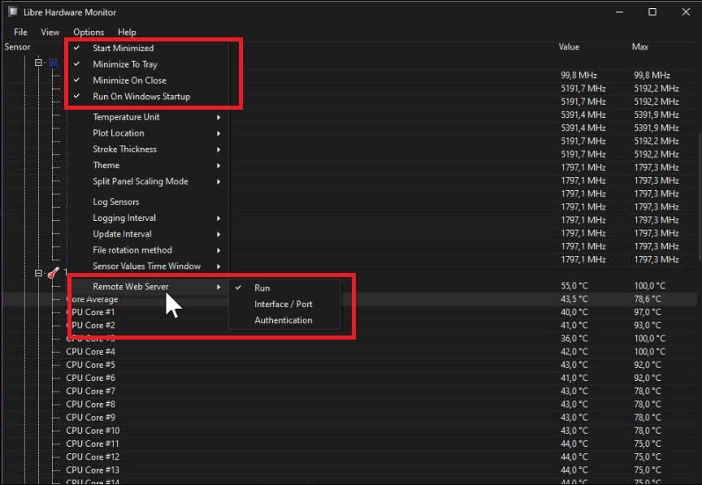

# step 1 : dl and install libreHardwareMonitor on windows pc https://github.com/LibreHardwareMonitor/LibreHardwareMonitor/releases
# step 2 : run libreHardwareMonitor and config it



# step 3 : on pikvm terminal root
```
rw 
touch /tmp/lhm-data.json
ln -sf "/tmp/lhm-data.json" "/usr/share/kvmd/web/share/data.json"
vi /usr/local/bin/poll-lhm.sh
```

add this content: 
```
#!/bin/bash

# url for libreHardwareMonitor
URL="http://192.168.1.19:8085/data.json"
TMP_FILE="/tmp/lhm-data.json"

while true; do
    if curl -s --fail --connect-timeout 1 --max-time 2 "$URL" -o "${TMP_FILE}.tmp"; then
        mv "${TMP_FILE}.tmp" "$TMP_FILE"
    fi
    sleep 1
done
```

add exec perm
```chmod +x /usr/local/bin/poll-lhm.sh```

create service

```vi /etc/systemd/system/poll-lhm.service```

add this content
```
[Unit]
Description=Poll LibreHardwareMonitor JSON and write to KVMD
After=network.target

[Service]
ExecStart=/usr/local/bin/poll-lhm.sh
Restart=always
User=root

[Install]
WantedBy=multi-user.target
```


run this commands :
```
systemctl daemon-reexec
systemctl daemon-reload
systemctl enable --now poll-lhm.service
```


# step 4 : js file
i put the js file in the repo into : 
```/usr/share/kvmd/web/share/js/lhm-monitor.js```

# step 5 : i modify the /usr/share/kvmd/web/kvm/index.html
in header section i add line 54 : 
```<script src="../share/js/lhm-monitor.js"></script>```

and i add after  ```<li class="right feature-disabled" id="gpio-dropdown">...</li>``` this : 
```
    <li class="right hidden" id="monitor-dropdown"><a class="menu-button" id="monitor-menu-button" href="#"><span></span></a>
      <div class="menu" id="monitor-menu"></div>
    </li>
```

# nb, if you cannot have access to http://yourip:8085/data.json on pikvm, it's because your windows firewall blocked the port, add exception for this port on your firewall
visual : 


